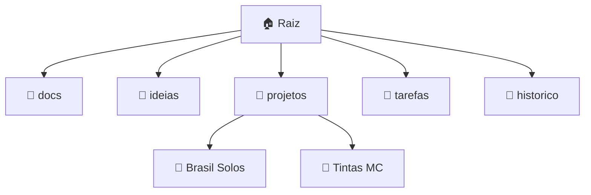

# 🧠 TARS Cockpit

🚀 **Clique** nos blocos acima ou navegue pelas pastas.

* **Projetos ativos**
  * 🔬 **Brasil Solos** – orçamentos automáticos, follow-up.
  * 🎨 **Tintas MC** – especialista em tintas, upsell e histórico de pedidos.

* **Board em tempo real** → [Project Tasks](../../projects/1)
* **Calendário de reuniões** → vista *Timeline* no mesmo Project.
